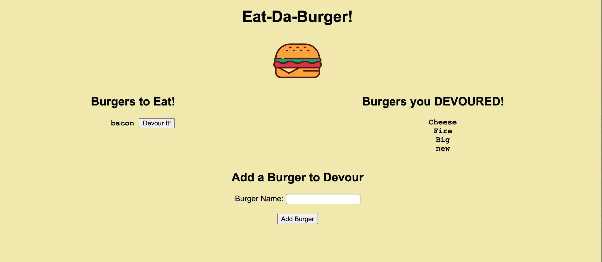

# burger

A burger logger with MySQL, Node, Express, Handlebars and ORM.

## Description

Project consists of a burger logger. User can log a burger type and click the button to devour it(move it from left to right side).

## Technology Used

- HTML5
- CSS3
- MYSQL
- ORM
- HANDLEBARS
- JAVASCRIPT
- node.js
- HEROKU

#Screenshot \* "screenshot")
